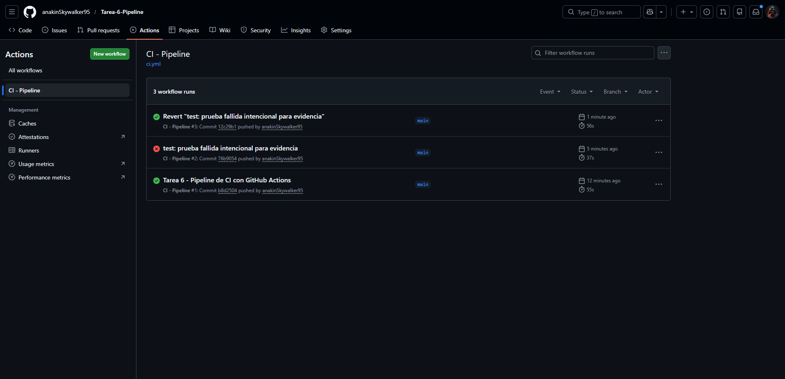
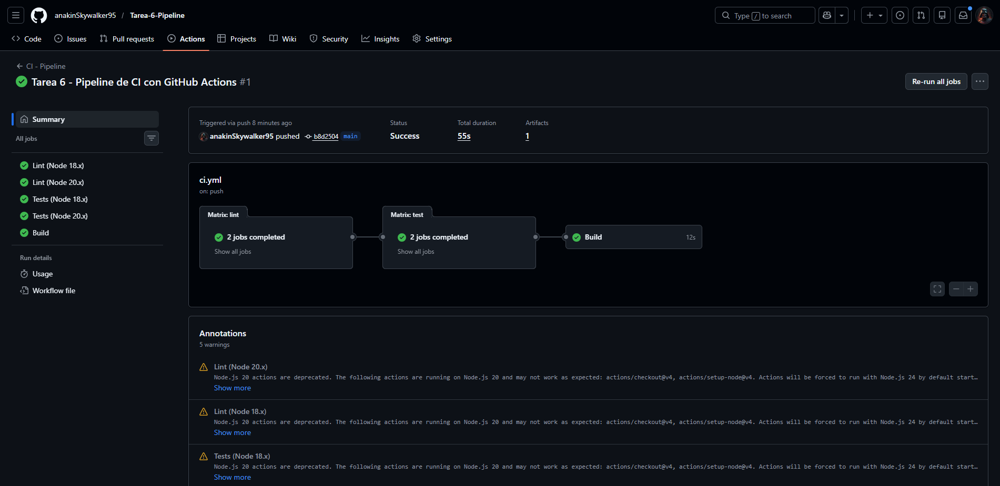
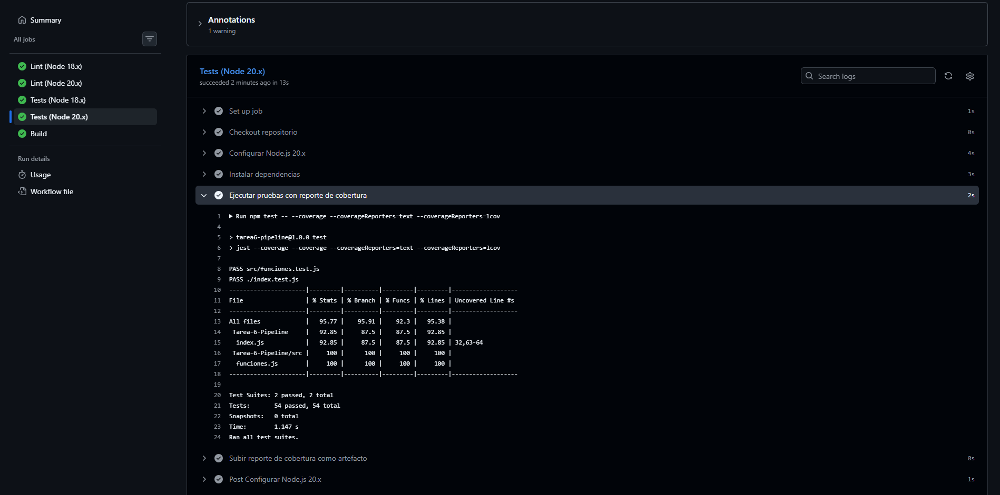
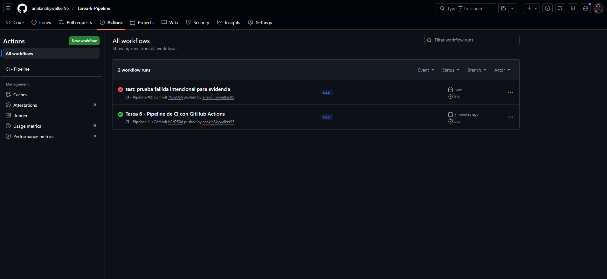

# Tarea 6 - Pipeline

[](https://github.com/anakinSkywalker95/Tarea-6-Pipeline/actions/workflows/ci.yml)

Proyecto Node.js con pipeline de integración continua usando GitHub Actions.

---

## Descripción

API REST construida con Express que expone 5 funciones utilitarias independientes:

| Función | Descripción |
|---|---|
| `calcularIVA(precio, tasa)` | Calcula el IVA de un precio (tasa por defecto 12%) |
| `validarEmail(email)` | Valida si un string tiene formato de email válido |
| `calcularDescuento(precio, porcentaje)` | Calcula el precio final con descuento aplicado |
| `celsiusAFahrenheit(celsius)` | Convierte temperatura de °C a °F |
| `esPrimo(numero)` | Verifica si un número entero es primo |

---

## Requisitos

- Node.js >= 18.x
- npm >= 9.x

---

## Instalación

```bash
# Clonar el repositorio
git clone https://github.com/anakinSkywalker95/Tarea-6-Pipeline.git
cd Tarea-6-Pipeline

# Instalar dependencias
npm install
```

---

## Ejecución Local

```bash
# Iniciar servidor (puerto 3000)
npm start

# Ejecutar pruebas unitarias con reporte de cobertura
npm test

# Ejecutar linting
npm run lint

# Verificar build
npm run build
```

---

## Endpoints disponibles

```
GET  /                          → Estado de la API
GET  /health                    → Health check
GET  /iva/:precio               → Calcular IVA (12%) de un precio
GET  /descuento/:precio/:pct    → Precio con descuento aplicado
POST /email/validar             → Validar formato de email (body: { email })
GET  /celsius/:valor            → Convertir °C a °F
GET  /primo/:numero             → Verificar si un número es primo
```

### Ejemplos

```bash
curl http://localhost:3000/iva/100
# {"precio":100,"iva":12,"total":112}

curl http://localhost:3000/descuento/200/25
# {"precio":200,"porcentaje":25,"precioFinal":150}

curl -X POST http://localhost:3000/email/validar \
  -H "Content-Type: application/json" \
  -d '{"email":"usuario@ejemplo.com"}'
# {"email":"usuario@ejemplo.com","valido":true}

curl http://localhost:3000/celsius/100
# {"celsius":100,"fahrenheit":212}

curl http://localhost:3000/primo/17
# {"numero":17,"esPrimo":true}
```

---

## Pipeline CI

El workflow `.github/workflows/ci.yml` se ejecuta en cada **push** y **pull request** a `main`.

### Jobs

```
lint  →  test  →  build
```

| Job | Descripción |
|---|---|
| **lint** | Verifica estilo de código con ESLint |
| **test** | Ejecuta pruebas unitarias y genera reporte de cobertura |
| **build** | Verifica que el proyecto compila y el servidor inicia |

### Matrix Strategy

Los jobs `lint` y `test` corren en paralelo sobre:
- Node.js **18.x**
- Node.js **20.x**

### Cache de dependencias

Se usa `actions/setup-node@v4` con `cache: 'npm'` para acelerar la instalación de dependencias en runs posteriores.

### Artefactos

El reporte de cobertura se sube como artefacto (`coverage-report`) en cada run exitoso del job `test`.

---

## Estructura del proyecto

```
Tarea-6-Pipeline/
├── .github/
│   └── workflows/
│       └── ci.yml          # Workflow de CI
├── src/
│   ├── funciones.js        # Funciones utilitarias
│   └── funciones.test.js   # Tests unitarios de funciones
├── index.js                # Servidor Express + endpoints
├── index.test.js           # Tests de integración de la API
├── package.json
├── .eslintrc.json
└── README.md
```

---

## Cobertura de pruebas

El proyecto mantiene una cobertura mínima del **80%** en branches, funciones, líneas y statements (configurado en `package.json`).

```
Test Suites: 2 passed
Tests:       ~40 passed
Coverage:    >95%
```

---

---

## Evidencias

### Run exitoso en Actions



### Detalle de jobs: lint → test → build



### Reporte de cobertura de pruebas



### Run fallido y su arreglo



---

## Josue Erazo - Sistemas Operativos
